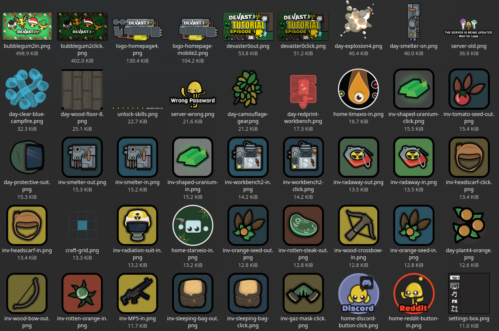

# Devast.io Assets
>_A bunch of scripts to download images from the `devast.io` files (a crappy game made by infamous company)._
>_This repo doesn't contain actual assets filets._

</br>

## Overview
Currently scripts download only images. 

## Requirements
GNU Make installed on your system

## Usage 

Run in cloned repo
```
make
```
The above command will download all missing images listed in the `./assets-img.txt` file into the `img/` folder in the current working directory (about 2482 files).

Note: there might be duplicates. Assets also have shadow duplicates: assets that are modified to represent different condition of in-game items. Like wall during day/night/borken etc.
A lot of duplicates.

## Troubleshooting
By 2023 not all files might be downloadable. Contanct author in case of failures or try to fix script yorself.

## Legal disclaimer

This project is intended for reference only. For commercial use of assets refer to the `devast.io` owner. I personally encourage copying their crappy game whether legally or illegally.

## Open-Source, not Open-Contribution
***Devast.io Assets*** is open-source project, meaning that you can make as many copies of it as you want and do whatever you want with those copies, without limitation. But ***Devast.io Assets*** is not open-contribution. In order to keep ***Devast.io Assets*** in the public domain and ensure that the code does not become contaminated with proprietary or licensed content, the project does not accept patches from people who have not submitted an affidavit dedicating their contribution into the public domain.


## See also
* https://github.com/yamete0/Devast-Mod

----
> August 02, 2023
